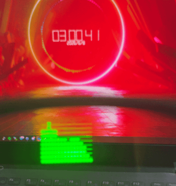

# sound2g2

PC で再生中の音をループバック録音し、FFT でざっくり帯域分解して、G2 Gateway の fast text 経由で全画面テキストのスペクトラムとして送る Python アプリです。正確さより見た目優先で、カーオーディオ風の遊び表示を狙っています。

深夜テンションで作りました  
当然バイブコーディングです



## 仕組み

- Windows の既定スピーカーをループバック録音
- numpy で FFT を実行し、対数帯域ごとにレベル化
- テキストだけの縦バー表示に変換
- POST /api/display に text を投げて全画面更新

API 側の 1000 バイト制限に収まるよう、デフォルト設定は安全側にしています。

既定の送信速度と縦行数は [sound2g2.py](sound2g2.py) の DEFAULT_SEND_FPS と DEFAULT_SPECTRUM_ROWS で簡単に変えられます。既定は 4FPS、行数は 10 行で、rows は 10 以下に制限しています。

## セットアップ

```powershell
python -m venv .venv
.\.venv\Scripts\Activate.ps1
python -m pip install --upgrade pip
python -m pip install -r requirements.txt
```

## 実行

[G2 Gateway](https://github.com/gpsnmeajp/men-g2-ble-gateway) が起動済みで、グラスが ready の状態を前提にしています。

```powershell
python sound2g2.py --clear-on-exit
```

API キーが有効な場合:

```powershell
python sound2g2.py --api-key YOUR_KEY --clear-on-exit
```

既定スピーカーではなく別デバイスを使いたい場合:

```powershell
python sound2g2.py --list-devices
python sound2g2.py --device-name "USB" --clear-on-exit
```

送信せずコンソールだけで挙動確認したい場合:

```powershell
python sound2g2.py --demo --no-send --frames 60
```

## よく使う調整

```powershell
python sound2g2.py --fps 8 --bands 20 --rows 10
python sound2g2.py --min-freq 60 --max-freq 10000
python sound2g2.py --device-name "Realtek" --fps 6
```

- 既定は 16FPS です。fps を上げると更新感は増えますが、Gateway とグラス側の負荷も上がります。
- bands を増やすと見た目は細かくなりますが、1000 バイト制限に近づきます。
- rows は 10 が上限です。増やすと縦の解像感は上がりますが、文字数も増えます。

## 補足

- 文字だけで描くので、厳密なスペアナではありません。
- 音が出ていないときは静かな表示になります。
- ループバック録音がうまく取れない場合は、Python 3.11 か 3.12 の 64bit 環境のほうが安定しやすいです。

## ライセンス
MIT LICENSE